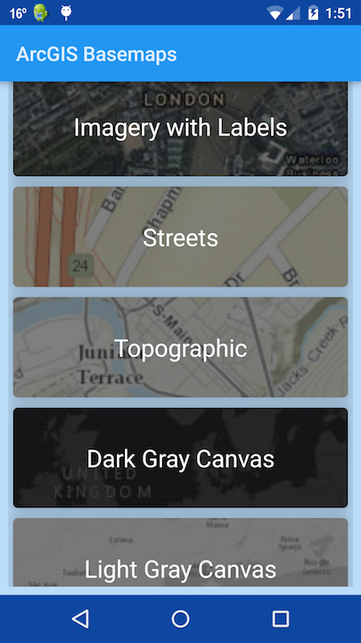

Material Basemaps
=======================
This app investigates some Material Design (http://www.google.com/design/spec/material-design/introduction.html) principles with Mapping applications built with the ArcGIS Android SDK.

MainActivity                           | Maps Activity
:-------------------------------------:|:-------------------------------------:
  | 

## Developer pattern
This app has 2 UI activities, MainActivity to show a list of basemaps from ArcGIS Online and a MapActivity to open the selected basemap in a `MapView` and allow for turning on/off your GPS location. 

### Type Hierarchy


### MainActivity
The MainActivity opens on start by creating a [RecyclerView](https://developer.android.com/training/material/lists-cards.html) card list and creating a `FetchBasemapsItemId` to query ArcGIS Online for a list of default [basemaps](http://www.esri.com/data/find-data#basemaps) to populate the `RecyclerView` card list.  The list is persisted in the `PersistBasemapItem` singleton allowing for only requiring a first time query of ArcGIS Online to get a list of Basemaps. Selecting a Basemap item from the list sends that items Portal Item ID and URL to the MapActivity to open in an `ArcGISMap`. 

### MapActivity
The MapActivity receives the portal URL (by default ArcGIS Online), the portal item ID, and the title of the basemap.  The portal URL is used as the server to fetch basemaps from.  You can change the URL as a String resource.  The portal item ID and URL is used to create a `PortalItem` to create an `ArcGISMap` to be displayed in a `MapView` as shown below: 

```java
// create a PortalItem from the Item ID
PortalItem portalItem = new PortalItem(portal, portalItemId);
// create an ArcGISMap from portal item
final ArcGISMap portalMap = new ArcGISMap(portalItem);
mMapView = new MapView(getApplicationContext());

// ensure MapView is loaded to set initial viewpoint
mMapView.addSpatialReferenceChangedListener(new SpatialReferenceChangedListener() {
  @Override
  public void spatialReferenceChanged(SpatialReferenceChangedEvent spatialReferenceChangedEvent) {
    // create point in web mercator
    Point initialPoint = new Point(-13617023.6399678998, 6040106.2917761272, SpatialReference.create(3857));
    // set initial viewpoint to ~ zoom level 11
    mMapView.setViewpointCenterAsync(initialPoint, 288895);
  }
});

mMapView.setMap(portalMap);
```

#### Location
A floating action button is provided to turn on GPS location to allow the app to zoom to the location of the device.  For devices using Android 6.0 and above, the app [requests permissions at runtime](https://developer.android.com/training/permissions/requesting.html) to allow for using `ACCESS_FINE_LOCATION` permission. 

## Licensing
Copyright 2017 Esri

Licensed under the Apache License, Version 2.0 (the "License"); you may not use this file except in compliance with the License. You may obtain a copy of the License at

http://www.apache.org/licenses/LICENSE-2.0

Unless required by applicable law or agreed to in writing, software distributed under the License is distributed on an "AS IS" BASIS, WITHOUT WARRANTIES OR CONDITIONS OF ANY KIND, either express or implied. See the License for the specific language governing permissions and limitations under the License.

A copy of the license is available in the repository's [license.txt](https://github.com/Esri/arcgis-runtime-demos-android/blob/master/license.txt) file.

For information about licensing your deployed app, see [License your app](https://developers.arcgis.com/android/guide/license-your-app.htm).
