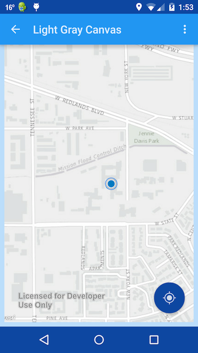

Material Basemaps
=======================
This app investigates some Material Design (http://www.google.com/design/spec/material-design/introduction.html) principles with Mapping applications built with the ArcGIS Android SDK.

MainActivity                           | Maps Activity
:-------------------------------------:|:-------------------------------------:
  | 

[Video demo](https://www.youtube.com/watch?v=_7QgwnSOAl4)

## Licensing
Copyright 2015 Esri

Licensed under the Apache License, Version 2.0 (the "License"); you may not use this file except in compliance with the License. You may obtain a copy of the License at

http://www.apache.org/licenses/LICENSE-2.0

Unless required by applicable law or agreed to in writing, software distributed under the License is distributed on an "AS IS" BASIS, WITHOUT WARRANTIES OR CONDITIONS OF ANY KIND, either express or implied. See the License for the specific language governing permissions and limitations under the License.

A copy of the license is available in the repository's [license.txt](https://github.com/Esri/arcgis-runtime-demos-android/blob/master/license.txt) file.

For information about licensing your deployed app, see [License your app](https://developers.arcgis.com/android/guide/license-your-app.htm).
