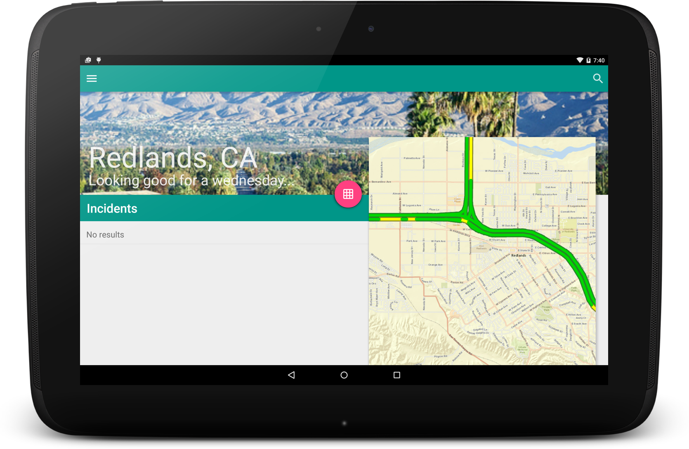

Traffic App
=======================
This is an example of a Map-as-context app, where the map itself is auxillery information and is altered based on other information and tools in the app. For more information on this pattern see [this Guide doc](https://developers.arcgis.com/android/guide/determine-your-app-map-pattern.htm).
It shows current traffic incidents and conditions for Redlands. You can click on a specific incident to zoom to its location. You can use the calendar tool to change the date to see historical or predictive traffic conditions. You can also pan and zoom the map to see other areas.

## Licensing
Copyright 2015 Esri

Licensed under the Apache License, Version 2.0 (the "License"); you may not use this file except in compliance with the License. You may obtain a copy of the License at

http://www.apache.org/licenses/LICENSE-2.0

Unless required by applicable law or agreed to in writing, software distributed under the License is distributed on an "AS IS" BASIS, WITHOUT WARRANTIES OR CONDITIONS OF ANY KIND, either express or implied. See the License for the specific language governing permissions and limitations under the License.

A copy of the license is available in the repository's [license.txt](https://github.com/Esri/maps-app-android/blob/master/license.txt) file.

For information about licensing your deployed app, see [License your app](https://developers.arcgis.com/android/guide/license-your-app.htm).
