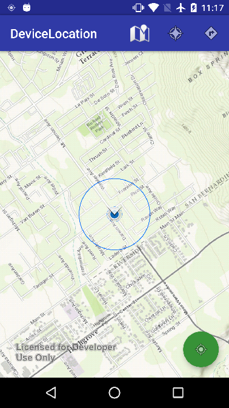

# Device Location

This demo demonstrates how you can enable Location Display and switch between different types of AutoPan Modes.

It also demonstrates how to use the Android Support Library to check for, and request, location permissions. The app is written to target Marshmallow devices, with backward compatibility to Android 4.1.x. It demonstrates the Marshmallow workflow for asking for location permissions, using the support library permissions API.

Uses ArcGIS Runtime SDK for Android version 10.2.7.

## Features
* LocationDisplayManager.setAutoPanMode
* ActivityCompat.requestPermissions
* ContextCompat.checkSelfPermission

## Requirements
* Android API level 16 (Android 4.1.x) or later, with internet access
* Android Studio
* Device or emulator with GPS

## Usage
Import into Android Studio by browsing to and choosing the root build.gradle file. Build the project and deploy the app to your device or emulator.

Tap the floating action button to start the LocationDisplayManager. Grant location permissions to the app, if required. Use the action bar buttons to choose between different AutoPanModes.

## Licensing
Copyright 2015 Esri

Licensed under the Apache License, Version 2.0 (the "License"); you may not use this file except in compliance with the License. You may obtain a copy of the License at

http://www.apache.org/licenses/LICENSE-2.0

Unless required by applicable law or agreed to in writing, software distributed under the License is distributed on an "AS IS" BASIS, WITHOUT WARRANTIES OR CONDITIONS OF ANY KIND, either express or implied. See the License for the specific language governing permissions and limitations under the License.

A copy of the license is available in the repository's [license.txt](https://github.com/Esri/arcgis-runtime-demos-android/blob/master/license.txt) file.

For information about licensing your deployed app, see [License your app](https://developers.arcgis.com/android/guide/license-your-app.htm).
