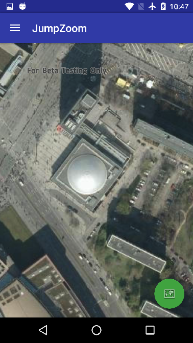
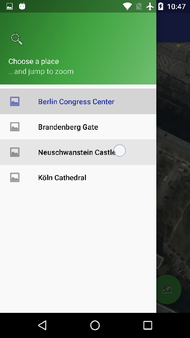

# Jump Zoom

Demo app showing how to chain together asynchronous navigation methods, waiting until one is complete before beginning a second navigation call. If first navigation is cancelled by the user interacting with the MapView, then the second navigation call is not made. Uses MapView navigation methods that return ListenableFuture.

Uses ArcGIS Runtime SDK for Android v100.0.0.

## Features
* MapView.setViewpointWithDurationAsync
* ListenableFuture
* NavigationCompletedListener

## Requirements
* Android API level 16 (Android 4.1.x) or later, with internet access
* Android Studio

## Usage
Import into Android Studio by browsing to and choosing the root build.gradle file. Build the project and deploy the app to your device or emulator.

Tap the menu icon to open the navigation drawer, and choose different locations to zoom to. The map will zoom out to show the extent of both the previous and next location, before zooming in again. Tap the floating action button to zoom out to full extent.

You can use the default gestures on the map to zoom in or out and pan the map; this will cancel any current programmatic navigation.

## Licensing
Copyright 2016 Esri

Licensed under the Apache License, Version 2.0 (the "License"); you may not use this file except in compliance with the License. You may obtain a copy of the License at

http://www.apache.org/licenses/LICENSE-2.0

Unless required by applicable law or agreed to in writing, software distributed under the License is distributed on an "AS IS" BASIS, WITHOUT WARRANTIES OR CONDITIONS OF ANY KIND, either express or implied. See the License for the specific language governing permissions and limitations under the License.

A copy of the license is available in the repository's [license.txt](https://github.com/Esri/arcgis-runtime-demos-android/blob/master/license.txt) file.

For information about licensing your deployed app, see [License your app](https://developers.arcgis.com/android/guide/license-your-app.htm).
