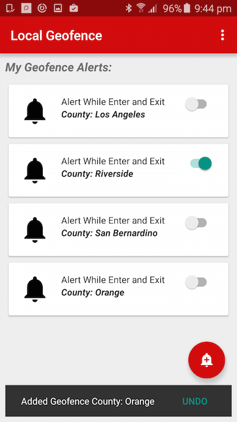

Local Geofence
=======================
This app uses [Google Fused Location Provider](https://developer.android.com/google/play-services/location.html), part of Google Play Services, to send notifications based on locally held geofences.

It provides an example of the 'Location-as-alerts' app pattern, described in the 'Building Great Android App Uis and UXs' technical session at the Esri Developer Summit 2016.

The description below describes how the app was set up and run during the demo, using Android's location mocking capability.

## Prerequisites
- Google Play Services latest version. See the [Android Developer help topic Setting up Google Play Services](http://developer.android.com/google/play-services/setup.html).
- For testing, you will need a device location mocking app supporting routes. For example, the app 'GPS Forger', [available on the Google Play Store](https://play.google.com/store/apps/details?id=com.ocd.dev.gpsforger&hl=en) was used in the technical session.
  - Most location mock apps work best when the Location mode in the device Location Settings is set to “Device only.
- Download demo datasets from ArcGIS.com:
  - [Cali2.geodatabase](http://www.arcgis.com/home/item.html?id=2228cbc5d00f491c9d9763bdf3f1fb92) - provides counties features used as geofences.
  - [LosAngelesRiverside.tpk](http://www.arcgis.com/home/item.html?id=8dcacb3dc08c4e299bcc2328af5b1110) - provides a basemap for the CurrentLocationActivity if device has no network connectivity.

## Setup
1. Copy the 2 offline demo data sets to device external storage under '/ArcGIS/California', for example /ArcGIS/California/Cali2.geodatabase, /ArcGIS/California/LosAngelesRiverside.tpk.
1. If using a location mocking app, set up a route crossing at least one Californian county boundary.

## Running the app
1. In the Local Geofence app, tap the floating action to select a county name as Geofence.
  - Alternatively, tap Overflow -> Choose fence from map to select a county by tapping on a map - tap the back button to use the currently selected county.
1. Switch 'on/off' an alert item to start/stop the geofence services.
1. Run the mock location route (or physically take the device across the boundary of the county that you selected).
 - When the device location enters or exits the selected county, Notifications appear in the notification drawer.
 - When the device location gets close or gets farther away from the county boundary, the frequency of location updates changes.

## Licensing
Copyright 2015 Esri

Licensed under the Apache License, Version 2.0 (the "License"); you may not use this file except in compliance with the License. You may obtain a copy of the License at

http://www.apache.org/licenses/LICENSE-2.0

Unless required by applicable law or agreed to in writing, software distributed under the License is distributed on an "AS IS" BASIS, WITHOUT WARRANTIES OR CONDITIONS OF ANY KIND, either express or implied. See the License for the specific language governing permissions and limitations under the License.

A copy of the license is available in the repository's [license.txt](https://github.com/Esri/arcgis-runtime-demos-android/blob/master/license.txt) file.

For information about licensing your deployed app, see [License your app](https://developers.arcgis.com/android/guide/license-your-app.htm).
