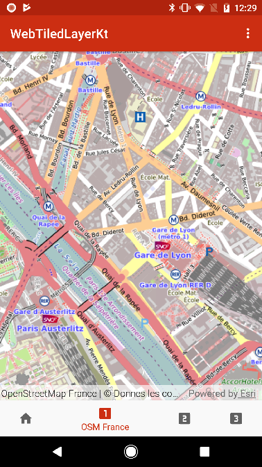

# WebTiledLayer
This demo demonstrates how to create a layer for a custom tiled service, by using `WebTiledLayer`. It is developed with the [Kotlin](http://kotlinlang.org/) programming language.

This was used in the plenary session of the Esri Developer Summit Europe, October 2017.



## Features
- `WebTiledLayer`
- `MapView`
- `Layer.setAttribution`

## Sample Pattern
This demo uses the `WebTiledLayer` class to display three tiled map services. A `WebTiledLayer` is created to display each service, and then added to the operational layers collection of a `MapView`.

```kotlinlang
// 1 - Define the set of subdomains available for this service
val subDomainsOsmFr = arrayListOf("a", "b", "c")

// 2 - Define the URL template, including placeholders for the subdomains, and the
// zoom level (Z), column (X) and row (Y) values that uniquely identify each tile
val templateUriOsmFr = "http://{subDomain}.tile.openstreetmap.fr/osmfr/{level}/{col}/{row}.png"

// 3- Create a WebTiledLayer with these values.
osmFranceLayer = WebTiledLayer(templateUriOsmFr, subDomainsOsmFr)

// 4 - Set appropriate data attribution for this layer.
osmFranceLayer.attribution = "OpenStreetMap France | © Donnes les contributeurs OpenStreetMap"

// Add the layer to the map,  Not visible by default
osmFranceLayer.isVisible = false
map.operationalLayers.add(osmFranceLayer)
```
*Note that the tiled map services used in this app are provided by third parties, and as such and Esri cannot assure the availability or future compatibility of these services. See Licensing section for more information.*

An Android framework `BottomNavigationView` is used to provide tabs to switch between the three different layers.

This demo takes advantage of [Kotlin Android Extensions](http://kotlinlang.org/docs/tutorials/android-plugin.html) which enhances the development experience by removing `findViewById()` to instantiate a `MapView`.

## Licensing

Use of the tiled map services used in this sample is subject to copyright for those services. Please refer to [OpenStreetMap](http://www.openstreetmap.org/copyright), [OpenStreetMap France](http://www.openstreetmap.fr), [OpenStreetMap Switzerland](https://www.osm.ch) and the [Geospatial Authority of Japan Website Terms of Use](http://www.gsi.go.jp) ([English version](http://www.gsi.go.jp/ENGLISH/page_e30286.html)).

Copyright 2017 Esri

Licensed under the Apache License, Version 2.0 (the "License"); you may not use this file except in compliance with the License. You may obtain a copy of the License at

http://www.apache.org/licenses/LICENSE-2.0

Unless required by applicable law or agreed to in writing, software distributed under the License is distributed on an "AS IS" BASIS, WITHOUT WARRANTIES OR CONDITIONS OF ANY KIND, either express or implied. See the License for the specific language governing permissions and limitations under the License.

A copy of the license is available in the repository's [license.txt](https://github.com/Esri/arcgis-runtime-demos-android/blob/master/license.txt) file.

For information about licensing your deployed app, see [License your app](https://developers.arcgis.com/android/guide/license-your-app.htm).
